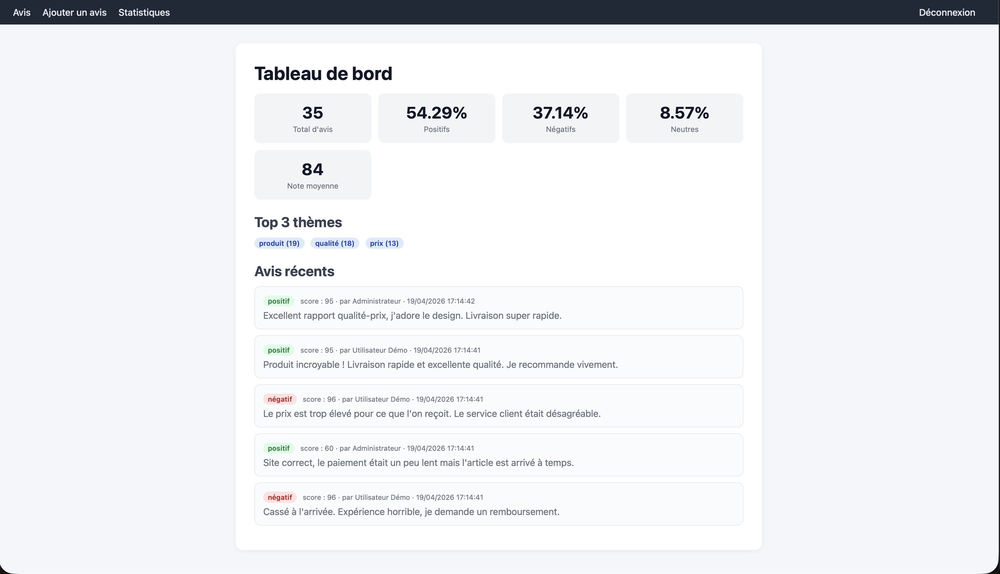
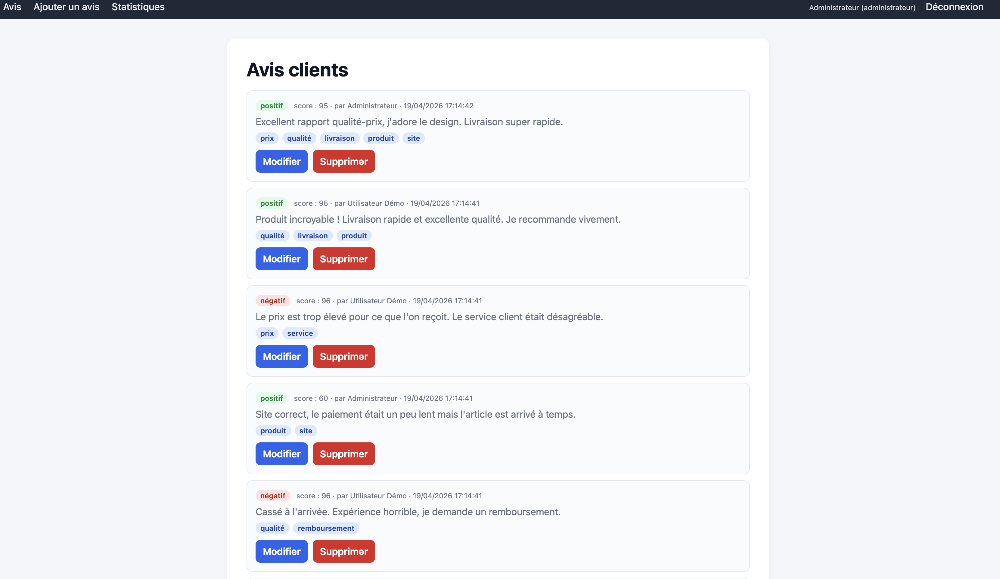
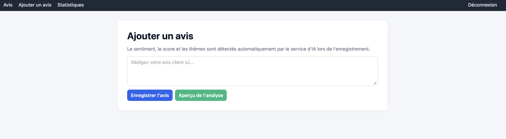

# 🌟 AvisHub — AI-Powered Customer Reviews Platform

> A full-stack web application that collects customer reviews and analyzes them in real time using a **Hugging Face sentiment model**, with automatic **topic extraction** and a clean **dashboard of KPIs**.

**Stack:** Laravel 12 · PHP 8.2 · SQLite · Sanctum · Hugging Face Inference API · Vanilla JS / HTML / CSS

---

## 📸 Screenshots

### 🔐 Login
Secure token-based authentication powered by Laravel Sanctum.



### 📝 Reviews list
Browse, edit, and delete reviews. Admins see everything, users see only their own.



### ✍️ Add a review (with live AI preview)
Type a review → the **`/api/analyze`** endpoint returns sentiment + score + topics **without saving**. You submit only when you're happy with the result.



### 📊 Dashboard / KPIs
Aggregated stats, top topics, and recent reviews — all computed server-side from SQLite.


---

## 🏛 Architecture

A **decoupled** architecture: a pure-JSON Laravel API on one side, a static vanilla-JS frontend on the other. They only talk via HTTP.

```
┌─────────────────────┐        HTTP + JSON          ┌────────────────────┐
│  Frontend (static)  │ ◄──────────────────────►    │  Laravel backend   │
│                     │                             │                    │
│   js/api.js         │                             │   routes/api.php   │
│     └─ apiFetch()   │                             │     └─ Controllers │
│                     │                             │          ├─ Auth   │
│   login.html        │                             │          ├─ Review │
│   add-review.html   │                             │          ├─ Analyze│
│   reviews.html      │                             │          └─ Dashboard
│   stats.html        │                             │                    │
└─────────────────────┘                             └────────────────────┘
    localStorage: token, user            SQLite: users, reviews, tokens
                                                       │
                                                       ▼
                                        ┌──────────────────────────┐
                                        │  Hugging Face Inference  │
                                        │  (sentiment model)       │
                                        └──────────────────────────┘
```

### Request flow (single review submission)

```
User types review
     │
     ▼
POST /api/analyze   ──►  AnalyzeController  ──►  HuggingFaceService::analyze()
                                                       │
                                                       ├─ extractTopics()  (local)
                                                       │
                                                       └─ callHuggingFace() (API)
                                                               │
                                                               ▼
                                                  {sentiment, score, topics}
     ◄──────────────────────── JSON response ─────────────────────┘
     │
     ▼
User clicks "Submit"
     │
     ▼
POST /api/reviews   ──►  ReviewController::store  ──►  Review::create()  ──►  SQLite
```

---

## ✨ Features

| | |
|---|---|
| 🔐 **Auth** | Registration, login, logout via Sanctum Bearer tokens |
| 👥 **Roles** | `admin` (sees every review) & `user` (sees their own) — enforced by `ReviewPolicy` |
| 🤖 **AI sentiment** | Every review is classified *positive / neutral / negative* with a confidence score (0–100) |
| 🏷 **Topic extraction** | 7 business topics detected by a bilingual (FR + EN) keyword lexicon — *prix, qualité, livraison, service, produit, site, remboursement* |
| 🔄 **Graceful fallback** | If Hugging Face is unreachable, a local rule-based classifier keeps the app working |
| 🧪 **Live preview** | `/api/analyze` returns the full analysis without persisting — perfect for a "try before you commit" UX |
| 📈 **Dashboard** | KPIs, top 3 topics, 5 latest reviews — all scoped by role |
| 📝 **CRUD** | Full create/read/update/delete on reviews, with re-analysis on content change |

---

## 🗂 Project structure

```
ReviewsApp/
├── backend/                              Laravel 12 API
│   ├── app/
│   │   ├── Http/
│   │   │   ├── Controllers/Api/          Auth · Review · Analyze · Dashboard
│   │   │   ├── Requests/                 StoreReviewRequest, UpdateReviewRequest
│   │   │   └── Middleware/               EnsureUserRole
│   │   ├── Models/                       User, Review
│   │   ├── Policies/                     ReviewPolicy
│   │   └── Services/
│   │       └── HuggingFaceService.php    ← sentiment + topics pipeline
│   ├── config/services.php               Hugging Face config
│   ├── database/
│   │   ├── database.sqlite               Single-file DB
│   │   ├── migrations/
│   │   └── seeders/
│   └── routes/api.php                    All API routes in one place
│
├── frontend/                             Static site (no build step)
│   ├── index.html      login.html
│   ├── reviews.html    add-review.html   stats.html
│   ├── js/api.js                         ← central `apiFetch` client
│   └── css/styles.css
│
├── docs/
│   └── screenshots/                      UI captures
│
├── Documentation_API.pdf                 Full REST endpoint reference
├── RAPPORT.pdf                           Project report
├── setup.sh                              One-shot install
└── start.sh                              Launches API + frontend together
```

---

## 🚀 Quick start

**Prerequisites:** PHP 8.2+, Composer, Python 3 (used only to serve the static frontend).

```bash
./setup.sh     # installs deps, creates .env, builds SQLite, runs migrations + seeders
./start.sh     # launches API on :8000 and frontend on :5500
```

Then open **http://localhost:5500/login.html** and log in with:

| Email | Password | Role |
|---|---|---|
| `admin@example.com` | `password` | admin |
| `user@example.com` | `password` | user |

> 💡 To use the **real Hugging Face model** instead of the local fallback, add `HUGGINGFACE_API_TOKEN=hf_xxx` to `backend/.env`.

### Manual install

<details>
<summary>Backend step by step</summary>

```bash
cd backend
composer install
cp .env.example .env
php artisan key:generate
touch database/database.sqlite
php artisan migrate --seed
php artisan serve     # http://localhost:8000
```
</details>

<details>
<summary>Frontend step by step</summary>

```bash
cd frontend
python3 -m http.server 5500
# open http://localhost:5500/login.html
```

Edit `frontend/js/api.js` if your Laravel server is not on `http://localhost:8000`.
</details>

---

## 🧠 How the AI works

### The pipeline

```
Review text
    │
    ├─► extractTopics()       (local, keyword-based)   → ["prix", "livraison"]
    │
    └─► callHuggingFace()     (remote, RoBERTa model)  → {"sentiment":"positive", "score":94}
            │
            └─► on failure: ruleBasedSentiment()       (local, keyword fallback)
```

### Hugging Face call (the real deal)

`backend/app/Services/HuggingFaceService.php`:

```php
$response = Http::withToken($token)
    ->timeout($timeout)
    ->acceptJson()
    ->post($url, [
        'inputs'  => $text,
        'options' => ['wait_for_model' => true],
    ]);
```

The model **`cardiffnlp/twitter-roberta-base-sentiment-latest`** always returns 3 probabilities (positive / neutral / negative). The code keeps only the **highest-confidence** label:

```php
$best = collect($predictions)->sortByDesc('score')->first();

return [
    'sentiment' => $this->normalizeLabel($best['label']),   // "positive" / "negative" / "neutral"
    'score'     => (int) round(((float) $best['score']) * 100),   // 0–100
];
```

### Fallback (no network? no problem)

If the HF call fails (no token, timeout, 5xx, etc.), a pure-PHP keyword counter kicks in — so the app **never** fails to return a result:

```php
foreach ($positive as $w) { $pos += substr_count($lower, $w); }
foreach ($negative as $w) { $neg += substr_count($lower, $w); }

if ($pos > $neg)  return ['sentiment' => 'positive', 'score' => round($pos*100/($pos+$neg))];
if ($neg > $pos)  return ['sentiment' => 'negative', 'score' => round($neg*100/($pos+$neg))];
return ['sentiment' => 'neutral', 'score' => 50];
```

---

## 🌐 API overview

All routes are under `/api` and — except for `register` / `login` — require a `Bearer <token>` header.

| Method | Endpoint | Purpose |
|---|---|---|
| `POST` | `/register` | Create account |
| `POST` | `/login` | Get Sanctum token |
| `POST` | `/logout` | Revoke current token |
| `GET`  | `/me` | Current user profile |
| `POST` | `/analyze` | **Preview** sentiment + score + topics (no DB write) |
| `GET`  | `/reviews` | List reviews (scoped by role) |
| `POST` | `/reviews` | Create review (auto-analysis) |
| `GET`  | `/reviews/{id}` | Show one review |
| `PUT`  | `/reviews/{id}` | Update (re-analyzes if content changed) |
| `DELETE` | `/reviews/{id}` | Delete |
| `GET`  | `/dashboard/stats` | Totals, percentages, average score |
| `GET`  | `/dashboard/topics` | Top 3 topics with counts |
| `GET`  | `/dashboard/recent-reviews` | Latest 5 reviews |

Full reference → **[Documentation_API.pdf](Documentation_API.pdf)**.

### Quick curl smoke-test

```bash
# Login, grab a token
TOKEN=$(curl -s -X POST http://localhost:8000/api/login \
  -H 'Content-Type: application/json' \
  -d '{"email":"user@example.com","password":"password"}' | jq -r .token)

# Live analysis (no save)
curl -X POST http://localhost:8000/api/analyze \
  -H "Authorization: Bearer $TOKEN" -H 'Content-Type: application/json' \
  -d '{"content":"Super produit, livraison rapide !"}'

# Save a review (auto-analysis)
curl -X POST http://localhost:8000/api/reviews \
  -H "Authorization: Bearer $TOKEN" -H 'Content-Type: application/json' \
  -d '{"content":"Qualité catastrophique, cassé dès la première utilisation."}'

# Dashboard KPIs
curl http://localhost:8000/api/dashboard/stats -H "Authorization: Bearer $TOKEN"
```

---

## ⚙️ Configuration

Key environment variables (`backend/.env`):

```env
# Database — single SQLite file
DB_CONNECTION=sqlite

# Hugging Face
HUGGINGFACE_API_TOKEN=hf_your_token_here
HUGGINGFACE_MODEL=cardiffnlp/twitter-roberta-base-sentiment-latest
```

Swap to the multilingual variant for better French support:
```env
HUGGINGFACE_MODEL=cardiffnlp/twitter-xlm-roberta-base-sentiment
```

No code change needed — `normalizeLabel()` handles all label formats.

---

## 🗄 Database schema

```
users                       reviews
┌──────────┐                ┌──────────────┐
│ id       │◄───────────────│ user_id (FK) │
│ name     │                │ id           │
│ email    │                │ content      │
│ password │                │ sentiment    │   positive / neutral / negative
│ role     │                │ score        │   0–100 (confidence %)
│ ...      │                │ topics       │   JSON array
└──────────┘                │ created_at   │
                            │ updated_at   │
                            └──────────────┘
```

Plus the standard Laravel/Sanctum tables: `personal_access_tokens`, `sessions`, `cache`, `jobs`, `migrations`.

---

## 📚 Documentation

- 📘 **[Documentation_API.pdf](Documentation_API.pdf)** — full REST endpoint reference
- 📄 **[RAPPORT.pdf](RAPPORT.pdf)** — detailed project report

---

## 👥 Authors


| **Wassim RHILANE** 
| **Ilyasse DBIZA**  

---

<div align="center">

</div>
